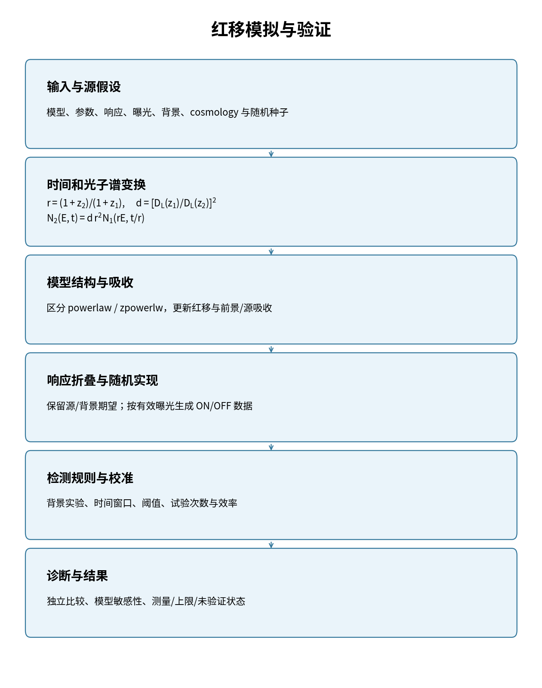

模拟、红移与可探测性
====================

接口选择
------------

``jinwu.lf.specfake`` 管理 XSPEC session、响应折叠与背景 fakeit 准备；
``jinwu.lf.lcfake`` 从 counts NPZ 建立模拟光变和显式 ON/OFF 样本。
``save_on_off_lightcurve`` / ``load_on_off_lightcurve`` 保存可追溯的模拟对象。
``RedshiftTriggerExtrapolator`` 和 ``HighZDetectabilityEstimator`` 提供高红移搜索入口。
这些工具需要输入谱模型与探测器响应，不能仅用距离缩放替代折叠预测。

输入与验证
------------

配置见 ``XspecConfig`` / ``KConfig``；记录源模型、所有参数、响应、背景、
曝光、区域缩放、能段、cosmology 与随机种子。
从 NPZ 模拟时先核查 time/counts/background 的约定与时间网格，
分别保存源期望、背景期望、随机实现和检测规则。
0.2.2 的 NPZ 模拟器优先使用 ``corrected_counts`` 净计数；否则将 ON 总计数
减去 ``area_ratio * corrected_counts_back``。只有 ON 模板时，可通过
``input_background_rate`` 指定输入背景率；``background_rate`` 仅表示目标背景。
源模板中的负净计数在读入阶段保留，生成非负 Poisson 期望时才截断；
这是一种模板估计，不是已完成的背景联合推断。输入时间网格须均匀。
``HighZDetectabilityEstimator`` 的 ``config_for_z`` 应随红移提供正确模型配置；
只伸缩时间不会自动实现完整的红移光谱变化。

红移的科学约定
--------------

下面的图展示一般光子谱变换与响应预测的关系，属于方法说明。
具体实现是否满足该关系需逐模型核验。

   固定源物理演化假设下的模拟检查路径。

令 :math:`r=(1+z_2)/(1+z_1)`，:math:`d=[D_L(z_1)/D_L(z_2)]^2`，
固定同一源本征演化时：

.. math::

   N_2(E,t)=d\,r^2 N_1(rE,t/r).

普通 XSPEC ``powerlaw`` 的 norm 因子为 :math:`d r^{2-\Gamma}`；
带模型自身 redshift 的 ``zpowerlw`` 需同时更新 redshift，其 norm 因子为 :math:`d r^2`。
对非平坦 cosmology，不应以径向 comoving distance 替代 luminosity distance。
推导、吸收成分、cflux 能段与待实现状态见下页。

.. toctree::
   :maxdepth: 1

   ../lf_redshift_transform

.. warning::

   遗留红移教程和当前模型适配不是通用科学验收。
   高红移触发边界需要固定模板/模型、背景、响应、随机试验与独立比较，
   返回一个 z 值不等于测量到了该源的真实探测极限。

API：:mod:`jinwu.lf.specfake`、:mod:`jinwu.lf.lcfake`、
:mod:`jinwu.lf.redshift`、:mod:`jinwu.lf.detectability`、:mod:`jinwu.lf.legacy_redshift`。
